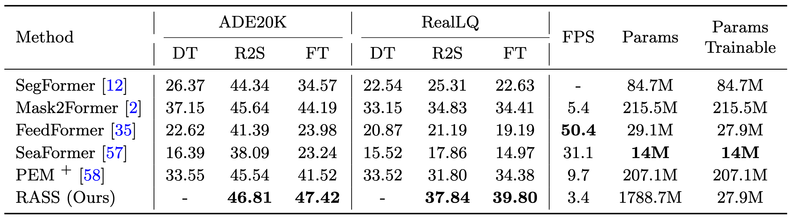

<div align="center">


<h1>Restoration Adaptation for Semantic Segmentation on Low Quality Images</h1>

<div>
    <a href='https://scholar.google.com/citations?user=oNZzFRIAAAAJ&hl=zh-CN' target='_blank'>Kai Guan<sup>1,2</sup></a>&emsp;
    <a href='https://scholar.google.com/citations?user=A-U8zE8AAAAJ&hl=zh-CN' target='_blank'>Rongyuan Wu<sup>1</sup></a>&emsp;
    <a href='https://scholar.google.com/citations?user=Bd73ldQAAAAJ&hl=zh-TW' target='_blank'>Shuai Li<sup>1</sup></a>&emsp;
    <a href='https://scholar.google.com/citations?user=ZEhMnIMAAAAJ&hl=en' target='_blank'>Wentao Zhu<sup>2</sup></a>&emsp;
    <a href='https://scholar.google.com/citations?user=_cUfvYQAAAAJ&hl=zh-CN' target='_blank'>Wenjun Zeng<sup>2,† </sup></a>
    <a href='https://www4.comp.polyu.edu.hk/~cslzhang/' target='_blank'>Lei Zhang<sup>1,2,† </sup></a>
</div>
<div>
    <sup>1</sup>The Hong Kong Polytechnic University, <sup>2</sup>Eastern Institute of Technology, Ningbo&emsp; 
</div>

[[paper]]()

</div>

---

## 📌 TODO

- [ ] Release the training and testing code for SCR

---

## 🎬 Overview


## <a name="dataset"></a>📂 Dataset

### 1. RealLQ Benchmark
**RealLQ** is a newly collected and annotated benchmark for semantic segmentation of real-world low-quality images. It is designed to encourage the community to explore and address the challenges of semantic segmentation in complex, real-world degraded scenarios.

* [**Download RealLQ**](https://drive.google.com/file/d/1ZjA0Vr5kPgSaHrnUHQNcTX5FRQNuybFD/view?usp=sharing)

> 💡 **Key Contribution:** RealLQ provides high-quality manual annotations for images suffering from authentic, non-simulated degradations, filling the gap between synthetic training and real-world application.

---

### 2. Simulated ADE20K-val
This dataset is used to verify the model's performance under controlled degradation. We apply [**Real-ESRGAN**](https://github.com/xinntao/Real-ESRGAN) to the original ADE20K validation set to generate these simulated low-quality images.

* [**Download Degraded ADE20K**](https://drive.google.com/file/d/1w_3fMVfwMEJs1Y9pPPknW2gqa33JbtNf/view?usp=sharing)

| Dataset | Source | Degradation Type |
| :--- | :--- | :--- |
| **RealLQ** | Real-world Capture | Authentic |
| **ADE20K-val** | ADE20K | [Real-ESRGAN](https://github.com/xinntao/Real-ESRGAN) (Simulated) |


## 🔧 Dependencies and Installation

1. **Clone repo**
    ```bash
    git clone https://github.com/Ka1Guan/RASS.git
    cd RASS
    ```

2. **Install dependent packages**
    ```bash
    conda create -n rass python=3.10 -y
    conda activate rass
    conda install pytorch==2.1.0 torchvision==0.16.0 torchaudio==2.1.0 pytorch-cuda=12.1 -c pytorch -c nvidia
    pip install --upgrade pip
    pip install -r requirements.txt

    # Build detectron2
    pip install -U opencv-python
    git clone git@github.com:facebookresearch/detectron2.git
    cd detectron2
    pip install -e .
    pip install git+[https://github.com/cocodataset/panopticapi.git](https://github.com/cocodataset/panopticapi.git)
    pip install git+[https://github.com/mcordts/cityscapesScripts.git](https://github.com/mcordts/cityscapesScripts.git)
    cd ..
    
    # Build Mask2Former
    cd rass/modeling/pixel_decoder/ops
    sh make.sh
    cd ../../../..
    ```

3. **Download Models**
    * [RASS](https://drive.google.com/file/d/14Ut18YU2OJ-J1OQHOQK6NTs-4PQYvrJp/view?usp=sharing)

    **Dependent Models**
    * [SD21 Base](https://huggingface.co/Manojb/stable-diffusion-2-1-base)
    * [RAM](https://huggingface.co/spaces/xinyu1205/recognize-anything/blob/main/ram_swin_large_14m.pth)
    * [DAPE](https://drive.google.com/file/d/1KIV6VewwO2eDC9g4Gcvgm-a0LDI7Lmwm/view?usp=drive_link)

    > 💡 **Note:** You can put all downloaded models into `preset/model`


##  Train
Before starting training, you need to prepare the dataset. Please refer to [Mask2Former](https://github.com/facebookresearch/Mask2Former/blob/main/datasets/README.md) to download and deploy ADE20K. Then download the simulated degradation validation set ([here](#dataset)) to replace the original standard-quality validation images. During training, input the standard-quality images and simulate degradation using [online data preprocessing](https://github.com/Ka1Guan/RASS/blob/5aca2916fe00da5ea3b899620097cb7b21a318cc/rass/modeling/backbone/rass_backbone.py#L101C53-L101C60).
```
python train_net.py --config-file configs/ade20k/semantic-segmentation/maskformer2_RASS.yaml --num-gpus 8
```

##  Test
To test the model, please download the low-quality image test set first ([here](#dataset)). For the ADE20K validation set, please place them directly in your dataset file, replacing the original validation set. For RealLQ, you can simply `export DETECTRON2_DATASETS=/path/to/RealLQ`.
```
python train_net.py --config-file configs/ade20k/semantic-segmentation/maskformer2_RASS.yaml \
--eval-only MODEL.WEIGHTS preset/model/rass.pth \
OUTPUT_DIR ./experiments
```

## 📊 Results

<p align="center">
  
  <br>
  <b>Table 1: Semantic segmentation (mIoU↑) on degraded ADE20K-val and RealLQ. Symbol <sup>+</sup> denotes an enhanced version, and "-" denotes not applicable. Best results are highlighted in bold.</b>
</p>

